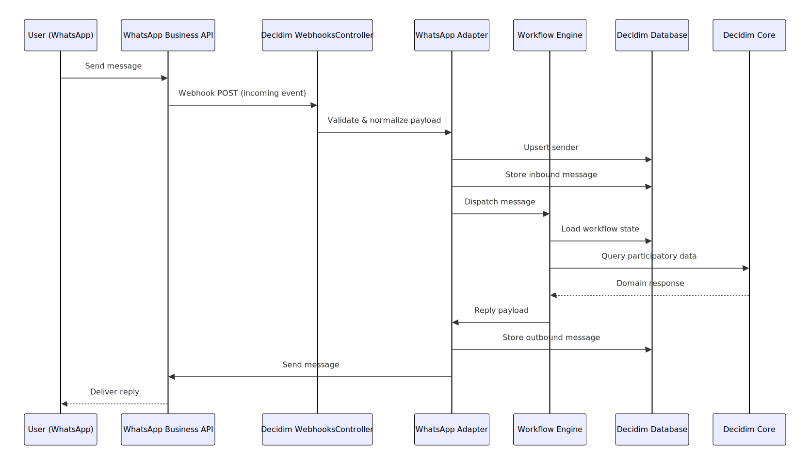

# Decidim::Chatbot

[![[CI] Lint](https://github.com/openpoke/decidim-module-chatbot/actions/workflows/lint.yml/badge.svg)](https://github.com/openpoke/decidim-module-chatbot/actions/workflows/lint.yml)
[![[CI] Test](https://github.com/openpoke/decidim-module-chatbot/actions/workflows/test.yml/badge.svg)](https://github.com/openpoke/decidim-module-chatbot/actions/workflows/test.yml)
[](https://qlty.sh/gh/openpoke/projects/decidim-module-chatbot)
[](https://codecov.io/gh/openpoke/decidim-module-chatbot)
[](https://badge.fury.io/rb/decidim-chatbot)

Chatbot for integrating Decidim participation in popular chat applications (ie: Whatsapp).

## Usage


## Quick Start

- **Communication is user-initiated**: Users must start conversations with your business WhatsApp number
- **24-hour messaging window**: After a user initiates contact, you have 24 hours to send messages before needing user re-engagement
- **Delivery status tracking**: Webhook notifications include message delivery status updates from Meta
- **Configurable conversation timeout**: Automatically reset conversations after a specified idle period

## Installation

Add this line to your application's Gemfile:

```ruby
gem "decidim-chatbot", github: "openpoke/decidim-module-chatbot"
```

And then execute:

```bash
bundle install
bin/rails decidim:upgrade
```

> **EXPERTS ONLY**
>
> When you run `bin/rails decidim:upgrade`, Decidim's upgrade process is extended by this gem so that `decidim_chatbot` is included in the set of plugins handled by `decidim:choose_target_plugins`. Once selected there, the standard Decidim upgrade pipeline will apply this plugin's migrations.
>
> Running `bin/rails decidim:upgrade` is usually all you need. However, you can also run the migrations for this gem explicitly with:
>
> ```bash
> bin/rails decidim_chatbot:install:migrations
> ```

### Architecture & workflows

#### Implementation Diagram


#### Final User Interaction Flow (End-to-End)


#### Workflows

Workflows provide a way to define what logic will users encounter when interacting with the chatbot.
Some workflows can be registered as "start workflows" using the standard Manifest mechanism in Decidim.

The admin must enable one of these "starting workflow" in order to allow communication between users and the chatbot.
Workflows can also be configured with certain settings (if applicable).

Other workflows can be started from the initial one, these workflows do not need to be registered in any manifest.


See the [Engine](lib/decidim/chatbot/engine.rb) for the initialization of the built-in start workflows:

```ruby
	Decidim::Chatbot.start_workflows_registry.register(:organization_welcome) do |manifest|
		manifest.workflow_class = "Decidim::Chatbot::Workflows::OrganizationWelcomeWorkflow"
	end
```

### Webhook endpoint

- Path (mounted): POST /chatbot/webhooks/:provider, GET /chatbot/webhooks/:provider
- Currently supported provider: `whatsapp`.
- WhatsApp verification (GET): set `WHATSAPP_VERIFY_TOKEN` in environment. Meta will call the endpoint with `hub.mode`, `hub.verify_token`, and `hub.challenge`. When the token matches, the endpoint echoes the `hub.challenge` with 200.
- Delivery (POST): the endpoint acknowledges with 200 for supported providers. Signature verification and payload processing can be added later per provider.

Example verify request:

```bash
curl -G \
	--data-urlencode "hub.mode=subscribe" \
	--data-urlencode "hub.verify_token=$WHATSAPP_VERIFY_TOKEN" \
	--data-urlencode "hub.challenge=abc123" \
	http://localhost:3000/chatbot/webhooks/whatsapp
```

Example delivery request:

```bash
curl -X POST http://localhost:3000/chatbot/webhooks/whatsapp \
	-H 'Content-Type: application/json' \
	-d '{"entry":[]}'
```

> In order to develop locally, it is convenient to use a service such as [ngrok](https://ngrok.com)
> to expose your local server to the internet. This allows Meta's webhook to reach your development environment.
> If you use ngrok, just start the proxy with:
>
> ```bash
> ngrok http 300
> ```
>
> This will give you a domain name, change the domain of your "localhost" organization:
>
> ``bash
> bin/rails c
> Decidim::Organization.first.update(host: "the-domain-from-ngrok")
> ```


## Providers

Note: Currently only WhatsApp is supported (PRs welcomed!)

### WhatsApp API Configuration

The Decidim Chatbot module supports integration with the **WhatsApp Business API**. Follow these steps to set up your WhatsApp developer environment.

#### 1. Create a WhatsApp Business Account
1. Go to [Meta for Developers](https://developers.facebook.com/) portal.
2. Create a **Facebook Business Manager** account if you don’t already have one.
3. Set up a **WhatsApp Business Account** and register a phone number.

#### 2. Generate Access Credentials
1. In your WhatsApp Business Account, create a **WhatsApp API app**.
2. Obtain the following credentials:
   - **Phone Number ID**
   - **WhatsApp API Token**
   - **Webhook Verify Secret** (used to validate the webhook endpoint, this is a user-defined value, needs to be configured in Decidim and Whatsapp developers settings)

#### 3. Configure Webhooks
1. In the WhatsApp API app settings, configure a **Webhook URL** pointing to your Decidim instance:
https://your-decidim-domain.com/chatbot/webhooks/whatsapp
2. Enable the following webhook events:
- `messages`
- `message_reactions`
- `message_deliveries` (optional)
3. Verify your webhook using the secret set in your Decidim Chatbot settings.

### 4. Environment Variables

Add the following variables to your `.env` or server environment:

```bash
# WhatsApp Provider Configuration
WHATSAPP_PROVIDER_NAME=whatsapp
WHATSAPP_VERIFY_TOKEN=anything-you-want-here
WHATSAPP_ACCESS_TOKEN=your_whatsapp_api_token_here
```

## Contributing

Contributions are welcome !

Bug reports and pull requests are welcome on GitHub at https://github.com/openpoke/decidim-module-chatbot.

We expect the contributions to follow the [Decidim's contribution guide](https://github.com/decidim/decidim/blob/develop/CONTRIBUTING.adoc).

### Developing

To start contributing to this project, first:

- Install the basic dependencies (such as Ruby and PostgreSQL)
- Clone this repository

Decidim's main repository also provides a Docker configuration file if you
prefer to use Docker instead of installing the dependencies locally on your
machine.

You can create the development app by running the following commands after
cloning this project:

```bash
$ bundle
$ DATABASE_USERNAME=<username> DATABASE_PASSWORD=<password> bundle exec rake development_app
```

Note that the database user has to have rights to create and drop a database in
order to create the dummy test app database.

Then to test how the module works in Decidim, start the development server:

```bash
$ cd development_app
$ DATABASE_USERNAME=<username> DATABASE_PASSWORD=<password> bundle exec rails s
```

In case you are using [rbenv](https://github.com/rbenv/rbenv) and have the
[rbenv-vars](https://github.com/rbenv/rbenv-vars) plugin installed for it, you
can add the environment variables to the root directory of the project in a file
named `.rbenv-vars`. If these are defined for the environment, you can omit
defining these in the commands shown above.

#### Code Styling

Please follow the code styling defined by the different linters that ensure we
are all talking with the same language collaborating on the same project. This
project is set to follow the same rules that Decidim itself follows.

[Rubocop](https://rubocop.readthedocs.io/) linter is used for the Ruby language.

You can run the code styling checks by running the following commands from the
console:

```
$ bundle exec rubocop
```

To ease up following the style guide, you should install the plugin to your
favorite editor, such as:

- Sublime Text - [Sublime RuboCop](https://github.com/pderichs/sublime_rubocop)
- Visual Studio Code - [Rubocop for Visual Studio Code](https://github.com/misogi/vscode-ruby-rubocop)

### Testing

To run the tests run the following in the gem development path:

```bash
$ bundle
$ DATABASE_USERNAME=<username> DATABASE_PASSWORD=<password> bundle exec rake test_app
$ DATABASE_USERNAME=<username> DATABASE_PASSWORD=<password> bundle exec rspec
```

Note that the database user has to have rights to create and drop a database in
order to create the dummy test app database.

In case you are using [rbenv](https://github.com/rbenv/rbenv) and have the
[rbenv-vars](https://github.com/rbenv/rbenv-vars) plugin installed for it, you
can add these environment variables to the root directory of the project in a
file named `.rbenv-vars`. In this case, you can omit defining these in the
commands shown above.

### Test code coverage

If you want to generate the code coverage report for the tests, you can use
the `SIMPLECOV=1` environment variable in the rspec command as follows:

```bash
$ SIMPLECOV=1 bundle exec rspec
```

This will generate a folder named `coverage` in the project root which contains
the code coverage report.

### Localization

If you would like to see this module in your own language, you can help with its
translation at Crowdin:

https://crowdin.com/project/decidim-module-chatbot

## Security

Security is very important to us. If you have any issue regarding security, please disclose the information responsibly by sending an email to __ivan [at] pokecode [dot] net__ and not by creating a GitHub issue.

## License

This engine is distributed under the [GNU AFFERO GENERAL PUBLIC LICENSE](LICENSE-AGPLv3.txt).
