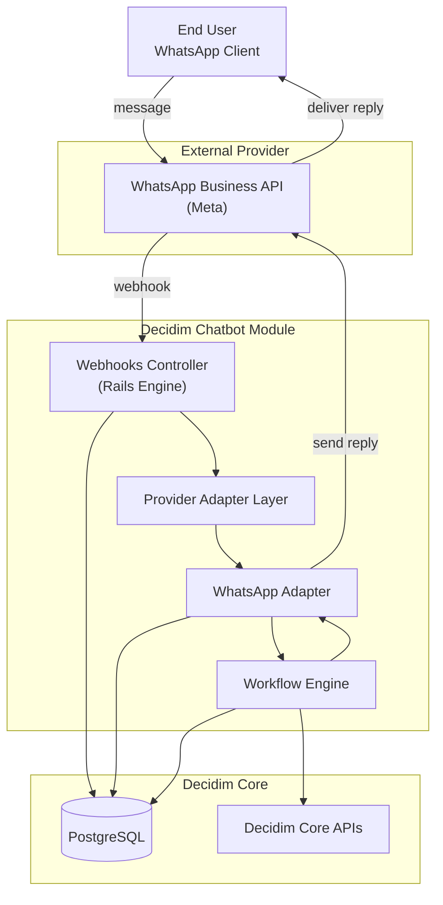
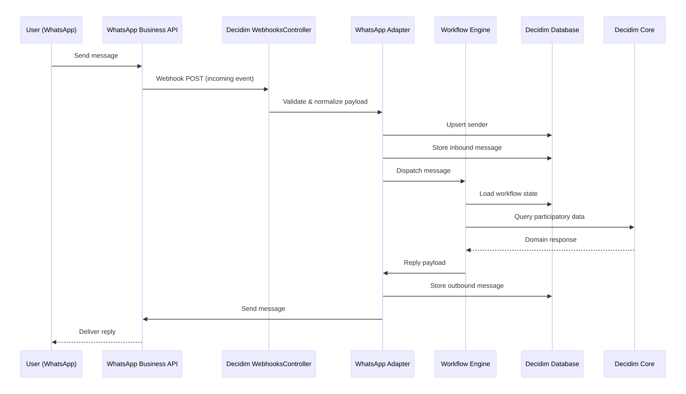

# Decidim::Chatbot

[![[CI] Lint](https://github.com/openpoke/decidim-module-chatbot/actions/workflows/lint.yml/badge.svg)](https://github.com/openpoke/decidim-module-chatbot/actions/workflows/lint.yml)
[![[CI] Test](https://github.com/openpoke/decidim-module-chatbot/actions/workflows/test.yml/badge.svg)](https://github.com/openpoke/decidim-module-chatbot/actions/workflows/test.yml)
[](https://qlty.sh/gh/openpoke/projects/decidim-module-chatbot)
[](https://codecov.io/gh/openpoke/decidim-module-chatbot)
[](https://badge.fury.io/rb/decidim-chatbot)

Chatbot for integrating Decidim participation in popular chat applications (ie: Whatsapp).

## Usage


## Quick Start

- **Communication is user-initiated**: Users must start conversations with your business WhatsApp number
- **24-hour messaging window**: After a user initiates contact, you have 24 hours to send messages before needing user re-engagement
- **Delivery status tracking**: Webhook notifications include message delivery status updates from Meta
- **Configurable conversation timeout**: Automatically reset conversations after a specified idle period

## Installation

Add this line to your application's Gemfile:

```ruby
gem "decidim-chatbot", github: "openpoke/decidim-module-chatbot"
```

And then execute:

```bash
bundle install
bin/rails decidim:upgrade
```

> **EXPERTS ONLY**
>
> When you run `bin/rails decidim:upgrade`, Decidim's upgrade process is extended by this gem so that `decidim_chatbot` is included in the set of plugins handled by `decidim:choose_target_plugins`. Once selected there, the standard Decidim upgrade pipeline will apply this plugin's migrations.
>
> Running `bin/rails decidim:upgrade` is usually all you need. However, you can also run the migrations for this gem explicitly with:
>
> ```bash
> bin/rails decidim_chatbot:install:migrations
> ```

### Architecture & workflows

#### Implementation Diagram


```mermaid
flowchart TD
    User["End User
    WhatsApp Client"]
    WA["WhatsApp Business API
    (Meta)"]

    subgraph subGraph0["External Provider"]
        WA
    end

    subgraph subGraph1["Decidim Chatbot Module"]
        WC["Webhooks Controller
        (Rails Engine)"]
        PA["Provider Adapter Layer"]
        WAA["WhatsApp Adapter"]
        WF["Workflow Engine"]
    end

    subgraph subGraph2["Decidim Core"]
        DB[("PostgreSQL")]
        DC["Decidim Core APIs"]
    end

    User -->|message| WA
    WA -->|webhook| WC
    WC --> PA
    PA --> WAA
    WAA --> WF
    WF --> DC
    WF --> WAA
    WC --> DB
    WAA --> DB
    WF --> DB
    WAA -->|send reply| WA
    WA -->|deliver reply| User
```

#### Final User Interaction Flow (End-to-End)


#### Workflows

Workflows provide a way to define what logic users encounter when interacting with the chatbot.

##### Workflow Types

**Start Workflows**: Registered workflows that can be selected by administrators as the initial conversation entry point. These are registered using Decidim's standard Manifest mechanism.

**Nested Workflows**: Any workflow can delegate to another workflow, creating a conversation flow. These don't need manifest registration.

##### Workflow Lifecycle

Each workflow inherits from `BaseWorkflow` and implements:

- `process_user_input` - Handles text messages from users
- `process_action_input` - Handles button clicks and interactive elements

When a message arrives:
1. The sender's current workflow is instantiated
2. If text message: `process_user_input` is called
3. If button click: `process_action_input` is called

##### Workflow Stack

Workflows are managed using a **stack** stored in `sender.workflow_stack`:

```ruby
# Delegate to another workflow (pushes to stack)
delegate_workflow(ProposalsWorkflow, component_id: 123)

# Exit current workflow (pops from stack)
exit_workflow
```

**Stack behavior:**
- **Empty stack**: Falls back to `setting.workflow` (the admin-configured start workflow)
- **Pushing**: Preserves the current workflow, switches to new one
- **Popping**: Returns to previous workflow (or resets if stack becomes empty)

**Example flow:**
```
Initial message:
  Stack: []
  Current: OrganizationWelcomeWorkflow (from settings)

User clicks "Participate":
  Stack: [ProposalsWorkflow]
  Current: ProposalsWorkflow

User views proposal details:
  Stack: [ProposalsWorkflow, CommentsWorkflow]
  Current: CommentsWorkflow

User exits comments:
  Stack: [ProposalsWorkflow]
  Current: ProposalsWorkflow

User exits proposals:
  Stack: []
  Current: OrganizationWelcomeWorkflow (from settings)
```

##### Configuration & Options

Workflows access configuration through the `config` helper:

```ruby
def config
  @config ||= (setting.config || {}).merge(options)
end
```

- **`setting.config`**: Admin-configured settings for start workflows
- **`options`**: Runtime options passed when delegating (e.g., `component_id`)
- Options take precedence over settings

**Updating options dynamically:**
```ruby
# Update current workflow's options (e.g., for pagination)
sender.current_workflow_options!(
  sender.current_workflow_options.merge(page: current_page + 1)
)
```

##### Creating Custom Workflows

1. **Create the workflow class:**

```ruby
module Decidim
  module Chatbot
    module Workflows
      class MyCustomWorkflow < BaseWorkflow
        def process_user_input
          send_message!(body: "Hello! You sent: #{received_message.text}")
        end

        def process_action_input
          case received_message.button_id
          when "option_1"
            send_message!("You chose option 1")
          when "exit"
            exit_workflow
          end
        end
      end
    end
  end
end
```

2. **Register as start workflow (optional):**

```ruby
# In an initializer or lib/decidim/chatbot/engine.rb
Decidim::Chatbot.start_workflows_registry.register(:my_custom) do |manifest|
  manifest.workflow_class = "Decidim::Chatbot::Workflows::MyCustomWorkflow"
  manifest.settings_partial = "decidim/chatbot/admin/settings/workflows/my_custom"
  manifest.form_class = "Decidim::Chatbot::Admin::MyCustomSettingsForm"
end
```

3. **Or delegate from another workflow:**

```ruby
delegate_workflow(MyCustomWorkflow, custom_param: "value")
```

##### Built-in Workflows

See the [Engine](lib/decidim/chatbot/engine.rb) for built-in start workflows:

```ruby
Decidim::Chatbot.start_workflows_registry.register(:organization_welcome) do |manifest|
  manifest.workflow_class = "Decidim::Chatbot::Workflows::OrganizationWelcomeWorkflow"
end
```

- **OrganizationWelcomeWorkflow**: Welcome message with organization info
- **SingleParticipatorySpaceWorkflow**: Navigate a specific participatory space
- **ProposalsWorkflow**: Browse and interact with proposals (nested workflow)
- **CommentsWorkflow**: View and interact with proposal comments (nested workflow)

### Webhook endpoint

- Path (mounted): POST /chatbot/webhooks/:provider, GET /chatbot/webhooks/:provider
- Currently supported provider: `whatsapp`.
- WhatsApp verification (GET): set `WHATSAPP_VERIFY_TOKEN` in environment. Meta will call the endpoint with `hub.mode`, `hub.verify_token`, and `hub.challenge`. When the token matches, the endpoint echoes the `hub.challenge` with 200.
- Delivery (POST): the endpoint acknowledges with 200 for supported providers. Signature verification and payload processing can be added later per provider.

Example verify request:

```bash
curl -G \
	--data-urlencode "hub.mode=subscribe" \
	--data-urlencode "hub.verify_token=$WHATSAPP_VERIFY_TOKEN" \
	--data-urlencode "hub.challenge=abc123" \
	http://localhost:3000/chatbot/webhooks/whatsapp
```

Example delivery request:

```bash
curl -X POST http://localhost:3000/chatbot/webhooks/whatsapp \
	-H 'Content-Type: application/json' \
	-d '{"entry":[]}'
```

> In order to develop locally, it is convenient to use a service such as [ngrok](https://ngrok.com)
> to expose your local server to the internet. This allows Meta's webhook to reach your development environment.
> If you use ngrok, just start the proxy with:
>
> ```bash
> ngrok http 3000
> ```
>
> This will give you a domain name, change the domain of your "localhost" organization:
>
> ``bash
> bin/rails c
> Decidim::Organization.first.update(host: "the-domain-from-ngrok")
> ```
> Then connect to https://the-domain-from-ngrok/ (note the port is not necessary)


## Providers

Note: Currently only WhatsApp is supported (PRs welcomed!)

### WhatsApp

The Decidim Chatbot module supports integration with the **WhatsApp Business API**.

For detailed setup instructions on how to configure WhatsApp in the Meta developer site, see the [WhatsApp Configuration Guide](docs/providers/whatsapp-configuration.md).

#### Quick Setup Summary

To quickly set up WhatsApp:

1. Create a WhatsApp Business Account at [Meta for Developers](https://developers.facebook.com/)
2. Register and verify a phone number
3. Generate API credentials (Access Token)
4. Configure your webhook URL in Meta
5. Set environment variables in Decidim (see [WhatsApp Configuration Guide](docs/providers/whatsapp-configuration.md#step-8-configure-decidim-chatbot))

For the complete step-by-step guide including troubleshooting, please refer to the [WhatsApp Configuration Guide](docs/providers/whatsapp-configuration.md).

## Contributing

Contributions are welcome !

Bug reports and pull requests are welcome on GitHub at https://github.com/openpoke/decidim-module-chatbot.

We expect the contributions to follow the [Decidim's contribution guide](https://github.com/decidim/decidim/blob/develop/CONTRIBUTING.adoc).

### Developing

To start contributing to this project, first:

- Install the basic dependencies (such as Ruby and PostgreSQL)
- Clone this repository

Decidim's main repository also provides a Docker configuration file if you
prefer to use Docker instead of installing the dependencies locally on your
machine.

You can create the development app by running the following commands after
cloning this project:

```bash
$ bundle
$ DATABASE_USERNAME=<username> DATABASE_PASSWORD=<password> bundle exec rake development_app
```

Note that the database user has to have rights to create and drop a database in
order to create the dummy test app database.

Then to test how the module works in Decidim, start the development server:

```bash
$ cd development_app
$ DATABASE_USERNAME=<username> DATABASE_PASSWORD=<password> bundle exec rails s
```

In case you are using [rbenv](https://github.com/rbenv/rbenv) and have the
[rbenv-vars](https://github.com/rbenv/rbenv-vars) plugin installed for it, you
can add the environment variables to the root directory of the project in a file
named `.rbenv-vars`. If these are defined for the environment, you can omit
defining these in the commands shown above.

#### Code Styling

Please follow the code styling defined by the different linters that ensure we
are all talking with the same language collaborating on the same project. This
project is set to follow the same rules that Decidim itself follows.

[Rubocop](https://rubocop.readthedocs.io/) linter is used for the Ruby language.

You can run the code styling checks by running the following commands from the
console:

```
$ bundle exec rubocop
```

To ease up following the style guide, you should install the plugin to your
favorite editor, such as:

- Sublime Text - [Sublime RuboCop](https://github.com/pderichs/sublime_rubocop)
- Visual Studio Code - [Rubocop for Visual Studio Code](https://github.com/misogi/vscode-ruby-rubocop)

### Testing

To run the tests run the following in the gem development path:

```bash
$ bundle
$ DATABASE_USERNAME=<username> DATABASE_PASSWORD=<password> bundle exec rake test_app
$ DATABASE_USERNAME=<username> DATABASE_PASSWORD=<password> bundle exec rspec
```

Note that the database user has to have rights to create and drop a database in
order to create the dummy test app database.

In case you are using [rbenv](https://github.com/rbenv/rbenv) and have the
[rbenv-vars](https://github.com/rbenv/rbenv-vars) plugin installed for it, you
can add these environment variables to the root directory of the project in a
file named `.rbenv-vars`. In this case, you can omit defining these in the
commands shown above.

### Test code coverage

If you want to generate the code coverage report for the tests, you can use
the `SIMPLECOV=1` environment variable in the rspec command as follows:

```bash
$ SIMPLECOV=1 bundle exec rspec
```

This will generate a folder named `coverage` in the project root which contains
the code coverage report.

### Localization

If you would like to see this module in your own language, you can help with its
translation at Crowdin:

https://crowdin.com/project/decidim-module-chatbot

## Security

Security is very important to us. If you have any issue regarding security, please disclose the information responsibly by sending an email to __ivan [at] pokecode [dot] net__ and not by creating a GitHub issue.

## License

This engine is distributed under the [GNU AFFERO GENERAL PUBLIC LICENSE](LICENSE-AGPLv3.txt).
